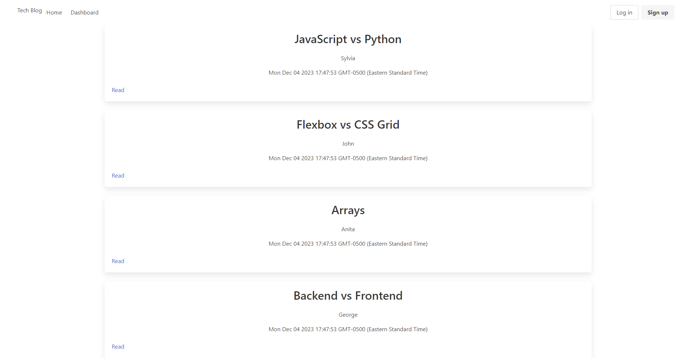

# Tech-Blog
## Overview

The Tech Blog CMS is a web application designed to empower developers to publish articles, share insights, and engage in discussions about various technical topics. Built following the MVC paradigm, this application leverages Handlebars.js as the templating language, Sequelize as the ORM, and express-session for authentication. The application follows a structured MVC architecture:
- Models: Utilizes Sequelize and MySQL2 to handle database interactions.
- Views: Employs Handlebars.js for dynamic and responsive user interfaces.
- Controllers: Implements Express.js APIs to manage application logic.

## Tech Blog Visualization

## Deployment
See it live at: https://fierce-forest-72948-0ca009035fd9.herokuapp.com/
